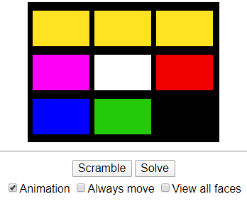

# Babel touch

Simulador do quebra cabeça cilíndrico Babel Tower. O objetivo é colocar todas as cores em linhas separadas após embaralhado. Versão TOUCH

<kbd></kbd>

https://shuantsu.github.io/babel_touch
